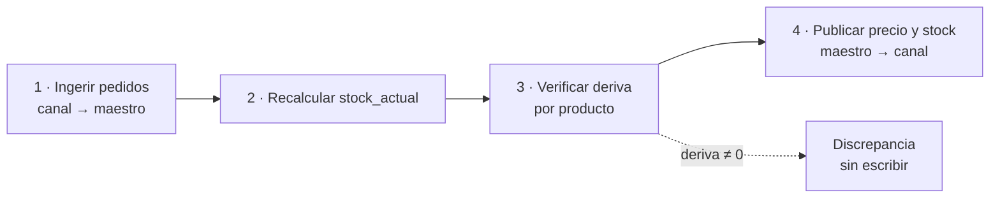

# SDD — Etapa 3: Sincronización bidireccional
## Especificación ejecutable

| | |
|---|---|
| **Proyecto** | `onplay-core` |
| **Etapa** | 3 de 6 |
| **Versión** | 1.1 |
| **Estado** | Vinculante. **Fase 0 aplicada con defaults el 2026-09-03** (se construye en local; claves de escritura, apertura del candado `SYNC_SOLO_LECTURA`, respaldo restaurado y staging quedan como precondiciones del dueño para encender el push en producción; conteo de ofertas: onplay.cl 0, onplaygames.cl 87). **Fases 1 (cimientos), 2 (E3c ingesta), 3 (E3a precio) y 4 (E3b stock + adopción) implementadas y verificadas por curl el 2026-09-03** contra onplaygames.cl real (criterios 1, 5, 7, 9, 10, 11, 12, 13, 15 y §8.3; las escrituras reales quedan bloqueadas por el candado hasta la Fase 0 del dueño). Decisiones de implementación en `08` R-016 y R-017. Fases 5 (pantallas) y 6 pendientes; los plazos de siete días entre subetapas corren en producción |
| **Fecha** | 25 de agosto de 2026 |
| **Documento padre** | `docs/01-SDD-general.md` |
| **Precedentes** | `docs/02-SDD-etapa1-mostrador.md` · Etapa 2 (Inventario) |
| **Diseño visual** | `docs/05-SDD-diseno-interfaz-etapa1.md` — Cristal OnPlay |
| **Destinatario** | Claude Code |

> ### ⛔ Dependencia bloqueante
>
> **Esta etapa no se puede construir sin la Etapa 2.** E3 publica el stock del maestro hacia los canales, y sin el inventario de E2 el maestro no tiene stock que publicar: `controlaStock` sigue en `false` para todo el catálogo (`02` §4.1, principio P4) y no hay libro de movimientos del que salga una cantidad.
>
> **E3a (precio) sí se puede construir sin E2.** Si el negocio necesita el push de precios antes que el inventario, se implementa E3a sola y se dejan E3b y E3c para cuando E2 esté en producción.
>
> **Lo que E2 debe entregar antes de E3b:** las tablas `ubicacion`, `movimiento_stock` y la vista `stock_actual`; el campo `Ubicacion.publicable` (§4.1); `controlaStock = true` al menos en snacks y sellado; y dos recuentos consecutivos que cuadren.

---

## 1. Qué resuelve esta etapa

**Objetivo O4:** que precio y stock se publiquen solos hacia los dos sitios web.

Hoy, cambiar el precio de un sobre significa entrar a wp-admin de onplaygames.cl, buscarlo y editarlo. Si además está en onplay.cl, dos veces. Y el stock que ve un cliente en línea no tiene ninguna relación con lo que hay en la vitrina.

Al terminar esta etapa, el maestro escribe y los canales obedecen.

## 2. Qué NO hace esta etapa

- **No fusiona los canales** (`01` §2.3), **no toca el checkout**, y **no publica productos nuevos**: E3 actualiza lo que ya existe y lo que E1 importó.
- **No sincroniza imágenes, nombres ni categorías.** Solo precio, stock y estado de publicación. Nombre y categoría son los dos campos que alguien puede haber ajustado a mano en wp-admin.
- **No gestiona ofertas.** Un producto con `sale_price` activo en el canal **no se toca** (§4.3). Modelar precio de lista y precio de oferta en el maestro es una etapa posterior.
- **No reserva stock de carritos abiertos.** Solo se ingiere lo que ya es un pedido `processing` o `completed`.
- **No revierte devoluciones automáticamente.** Un pedido cancelado, reembolsado o reembolsado en parte se reporta como discrepancia (§8.3).

---

## 3. Alcance funcional

| # | Funcionalidad | Subetapa | Prioridad |
|---|---|---|---|
| G1 | Push de precio hacia ambos canales | E3a | P0 |
| G2 | Push de stock con verificación previa | E3b | P0 |
| G3 | Ingesta de pedidos online → movimientos de stock | E3c | P0 |
| G4 | Adopción inicial masiva del stock del canal | E3b | P0 |
| G5 | Panel de discrepancias con resolución asistida | todas | P0 |
| G6 | Simulación obligatoria y sin efectos en toda escritura | todas | P0 |
| G7 | Bitácora de corridas con quién, cuándo y qué cambió | todas | P0 |
| G8 | Interruptor de push por canal y por tipo | todas | P0 |
| G9 | Publicación a demanda al guardar un precio | E3a | P1 |
| G10 | Reintento acotado de ítems fallidos | todas | P1 |

**Regla de alcance:** lo que no esté en esta lista está fuera de la Etapa 3.

---

## 4. El problema central: escribir sin pisar

La revisión del Binder OP (`03` P0 #2) documentó el fallo a evitar: el `PUT` enviaba `stock_quantity` con el valor absoluto del panel. Publicabas 4 copias, se vendían 3, volvías a sincronizar para corregir el precio y el stock regresaba a 4. **Tres cartas inexistentes puestas a la venta, sin ningún error visible.**

### 4.1 La solución: verificación previa contra el valor publicado

> **Esta sección es la implementación de la regla S2 de `01` §8.3.** S2 está redactada como *"push diferencial, nunca absoluto"*. La API `wc/v3` **no admite escritura incremental de stock**: solo acepta `stock_quantity` absoluto. La forma correcta de cumplir el espíritu de S2 —no pisar lo que no conocemos— es la verificación previa que sigue. `01` §8.3 se corrigió en consecuencia.

El maestro **recuerda qué publicó**. Antes de escribir, compara.

```
S_maestro   = SUM(stock_actual) del producto sobre las ubicaciones PUBLICABLES
S_canal     = stock_quantity leído del canal AHORA
S_publicado = último valor que este sistema escribió en ese canal
deriva      = S_canal − S_publicado
```

**`S_maestro` no es "el stock del producto".** El inventario de E2 es por ubicación (`01` §6.2): lo que hay en el mostrador, en las carpetas, en la vitrina y en la bodega. Publicar la suma de todas sobrevende; publicar solo una infravende. Por eso E2 debe entregar un campo **`Ubicacion.publicable`**, y E3 suma únicamente esas. La configuración inicial recomendada: `bodega` publicable, el resto no — es de donde sale un despacho.

| Caso | Significado | Acción |
|---|---|---|
| `deriva = 0` | Nadie tocó el canal desde nuestra última escritura | **Escribir** `S_maestro`. Guardar `S_publicado = S_maestro` |
| `deriva ≠ 0` | Algo pasó en el canal que el maestro no conoce | **No escribir.** Discrepancia `stock_derivado` |
| `S_publicado = null` | Nunca se publicó este producto | **No escribir.** Requiere adopción (§4.4) |

**Por qué no se aplica la diferencia a ciegas.** La alternativa tentadora es `S_canal + (S_maestro − S_publicado)`. Es peor: *absorbe la deriva en silencio*. El número queda plausible y nadie se entera de que hubo una venta online sin ingerir o un ajuste manual en wp-admin. La deriva es información, y taparla es el tipo de fallo que no se ve hasta que un cliente paga por algo que no existe.

**Ventana TOCTOU.** Entre leer `S_canal` y escribir hay milisegundos en los que puede entrar una venta online. Es un riesgo aceptado: la corrida siguiente detecta la deriva y detiene el producto. `S_publicado` se escribe en una transacción corta **después** de un `200` confirmado, nunca envolviendo la llamada HTTP.

### 4.2 Orden obligatorio



**Nunca se publica antes de ingerir.** Invertir el orden garantiza deriva en cada corrida y convierte el panel en ruido que nadie mira.

**El orden se garantiza por dependencia, no por reloj.** La unidad programada es `POST /sync/:canalId/completa`, que ejecuta los tres pasos en secuencia. Una corrida de stock lanzada por separado **se omite entera** si no existe una corrida de pedidos `terminada` iniciada en los últimos 20 minutos, y lo registra. Tres crones independientes no bastan: si la ingesta tarda más que el intervalo, el push corre con datos a medias (riesgo RS4).

### 4.3 Precio: misma disciplina, distinta política

| Caso | Acción |
|---|---|
| `regular_price` del canal = `precioPublicado` | Escribir el precio del maestro |
| `regular_price` ≠ `precioPublicado` | Escribir igual, **y** registrar `precio_derivado` (informativa) |
| **El producto tiene `sale_price` activo** | **No escribir.** Discrepancia `precio_en_oferta` |

Un precio pisado se arregla escribiendo otra vez; un stock pisado se arregla contando la vitrina. Por eso el precio avanza y el stock se detiene.

**La regla de la oferta es obligatoria y no es un detalle.** E1 importa a `precioVenta` el campo `price` de WooCommerce, que **ya incorpora el `sale_price`** (`02` §6.2, regla 1). Si E3 publicara ese número en `regular_price` de un producto en oferta, el precio de lista bajaría al de oferta, la oferta seguiría aplicándose sobre el nuevo valor, y el pull incremental volvería a leerlo: **cada corrida rebajaría el catálogo un escalón más.** E3 no toca productos en oferta, y punto.

### 4.4 Adopción inicial

Al encender E3b, **todos** los `ProductoCanal` tienen `stockPublicado = null`. Sin un paso de adopción, cada producto generaría `primera_publicacion` y no se escribiría nada nunca.

`POST /sync/:canalId/adoptar` (rol `admin`, `dryRun` por defecto) recorre los productos elegibles y fija `stockPublicado = S_canal` **sin escribir en el canal**. Es declarar "lo que hay allá es el punto de partida". Genera una `SyncCorrida` de tipo `adopcion` y queda en `Auditoria`.

`primera_publicacion` queda **excluida** del umbral de `ALERTA_DISCREPANCIAS` y del criterio de corte de RS4: no es una anomalía, es un estado inicial.

---

## 5. Modelo de datos

> **Los bloques siguientes son *diferencias* sobre `02` §4.1, no modelos completos.** El esquema resultante contiene los campos de E1 **más** los aquí listados. La Fase 1 entrega el `schema.prisma` consolidado como artefacto, y ese es el que manda.

### 5.1 Cambios sobre `ProductoCanal`

```prisma
model ProductoCanal {
  // ... todos los campos de 02 §4.1 ...

  // Referencia del bloqueo optimista de §4.1: lo que ESTE sistema escribió
  // por última vez. Sin esto no hay forma de distinguir "nadie tocó nada"
  // de "alguien cambió el stock".
  precioPublicado   Int?
  stockPublicado    Int?
  publicadoEn       DateTime?

  syncPrecio        EstadoSync  @default(pendiente)
  syncStock         EstadoSync  @default(pendiente)
  syncMensaje       String?     @db.Text

  discrepancias     Discrepancia[]

  @@index([canalId, syncStock])
  @@index([canalId, syncPrecio])
}

enum EstadoSync {
  pendiente
  al_dia
  por_publicar
  detenido
  error
}
```

> **`hashUltimoSync` de `02` §4.1 no participa del push.** Queda reservado al pull de catálogo de E1 para detectar cambios. La referencia del push es `precioPublicado` / `stockPublicado`. Dos mecanismos para lo mismo es una fuente de bugs; esto lo cierra.

### 5.2 Entidades nuevas

```prisma
enum TipoDiscrepancia {
  stock_derivado
  precio_derivado
  precio_en_oferta
  primera_publicacion
  producto_sin_mapear
  producto_desaparecido
  pedido_anulado
}

enum EstadoDiscrepancia {
  abierta
  resuelta
  descartada
}

enum TipoCorrida {
  pedidos
  precios
  stock
  adopcion
}

enum EstadoCorrida {
  en_curso
  terminada
  abortada
}

model Discrepancia {
  id                  String             @id @default(cuid())
  canalId             String
  canal               Canal              @relation(fields: [canalId], references: [id])
  productoCanalId     String?
  productoCanal       ProductoCanal?     @relation(fields: [productoCanalId], references: [id])
  pedidoCanalId       String?
  pedidoCanal         PedidoCanal?       @relation(fields: [pedidoCanalId], references: [id])
  pedidoCanalLineaId  String?
  pedidoCanalLinea    PedidoCanalLinea?  @relation(fields: [pedidoCanalLineaId], references: [id])

  tipo                TipoDiscrepancia
  estado              EstadoDiscrepancia @default(abierta)

  valorMaestro        Int?
  valorCanal          Int?
  valorPublicado      Int?
  vecesVista          Int                @default(1)
  vistaEn             DateTime           @default(now())
  detalle             String?            @db.Text

  creadaEn            DateTime           @default(now())
  resueltaEn          DateTime?
  resueltaPorId       String?
  resueltaPor         Usuario?           @relation("DiscrepanciasResueltas", fields: [resueltaPorId], references: [id])
  accionTomada        String?

  // Una sola discrepancia ABIERTA por producto y tipo: las corridas
  // siguientes actualizan la existente en vez de crear una nueva.
  // Sin esto, un producto atascado genera 48 filas al día.
  @@unique([productoCanalId, tipo, estado])
  @@index([canalId, estado, tipo])
  @@index([creadaEn])
}

model SyncCorrida {
  id           String        @id @default(cuid())
  canalId      String
  canal        Canal         @relation(fields: [canalId], references: [id])
  tipo         TipoCorrida
  estado       EstadoCorrida @default(en_curso)
  simulacion   Boolean       @default(true)
  iniciadaEn   DateTime      @default(now())
  terminadaEn  DateTime?

  leidos       Int           @default(0)
  aEscribir    Int           @default(0)   // cuántos se escribirían (o escribieron)
  escritos     Int           @default(0)
  omitidos     Int           @default(0)
  detenidos    Int           @default(0)
  fallidos     Int           @default(0)

  usuarioId    String?                      // null = corrida automática
  usuario      Usuario?      @relation(fields: [usuarioId], references: [id])

  items        SyncCorridaItem[]

  @@index([canalId, tipo, iniciadaEn])
  @@index([canalId, tipo, estado])
}

// Una fila por ítem no trivial (escrito, detenido, fallido). Los omitidos
// solo se cuentan. Purga a 90 días.
model SyncCorridaItem {
  id           String       @id @default(cuid())
  corridaId    String
  corrida      SyncCorrida  @relation(fields: [corridaId], references: [id], onDelete: Cascade)
  sku          String
  accion       String                       // "escribir" | "detener" | "fallar"
  valorAntes   Int?
  valorDespues Int?
  mensaje      String?      @db.Text

  @@index([corridaId])
}

model PedidoCanal {
  id                String    @id @default(cuid())
  canalId           String
  canal             Canal     @relation(fields: [canalId], references: [id])
  externoId         Int
  numero            String
  estadoCanal       String
  total             Int
  montoReembolsado  Int       @default(0)
  clienteEmail      String?
  clienteExternoId  Int?                    // customer_id de Woo; 0 o null = invitado
  clienteId         String?                 // resuelto vía ClienteCanal cuando exista E4
  cliente           Cliente?  @relation(fields: [clienteId], references: [id])
  creadoEnCanal     DateTime
  ingeridoEn        DateTime?
  revisadoEn        DateTime?               // última vez que se releyó para detectar cambios

  lineas            PedidoCanalLinea[]
  discrepancias     Discrepancia[]

  @@unique([canalId, externoId])
  @@index([canalId, ingeridoEn])
  @@index([clienteId])
}

model PedidoCanalLinea {
  id              String       @id @default(cuid())
  pedidoId        String
  pedido          PedidoCanal  @relation(fields: [pedidoId], references: [id], onDelete: Cascade)
  externoItemId   Int
  externoSku      String?
  descripcion     String
  cantidad        Int
  cantidadDevuelta Int         @default(0)
  precioUnitario  Int
  productoId      String?
  producto        Producto?    @relation(fields: [productoId], references: [id])

  discrepancias   Discrepancia[]

  @@index([pedidoId])
}
```

### 5.3 Cambios sobre `Canal`

```prisma
model Canal {
  // ... todos los campos de 02 §4.1 ...

  // Interruptores independientes (G8). Se encienden de a uno, en orden.
  ingestaPedidos      Boolean   @default(false)
  pushPrecio          Boolean   @default(false)
  pushStock           Boolean   @default(false)

  // Marcas de agua: avanzan SOLO al terminar una corrida con éxito.
  ultimaIngestaEn     DateTime?
  ultimoPushPrecioEn  DateTime?
  ultimoPushStockEn   DateTime?

  pedidos             PedidoCanal[]
  discrepancias       Discrepancia[]
  corridas            SyncCorrida[]
}
```

**Con `pushPrecio = true`, el pull incremental de `02` §6.5 deja de escribir `precioVenta` para ese canal.** En su lugar, si detecta un precio distinto, genera `precio_derivado`. Sin esta regla las dos corridas se pelean: wp-admin escribe al maestro por el pull y el maestro reescribe lo mismo por el push, y gana wp-admin — lo contrario de lo que exige `01` §8.4. Lo mismo aplica a `publicado` cuando `pushStock` está encendido.

### 5.4 Back-relations en modelos de E1

Prisma exige la relación declarada en ambos lados. Estas líneas se agregan a modelos que ya existen:

```prisma
model Usuario {
  // ... campos y relaciones de 02 §4.1 ...
  discrepanciasResueltas  Discrepancia[]  @relation("DiscrepanciasResueltas")
  corridas                SyncCorrida[]
}

model Producto {
  // ... campos y relaciones de 02 §4.1 ...
  lineasPedido            PedidoCanalLinea[]
}
```

### 5.5 Movimientos de stock que genera E3

E3 usa el libro de E2 (`01` §3, principio P5). Los motivos ya están definidos en `01` §6.2 y **no hace falta añadir ninguno**: `venta_online`, `ajuste` y `devolucion` están los tres.

| Motivo | Cuándo | Signo |
|---|---|---|
| `venta_online` | Ingesta de un pedido | Negativo |
| `devolucion` | Resolución de un `pedido_anulado` | Positivo |
| `ajuste` | Resolución con "adoptar el valor del canal" | Con signo |

Cada uno lleva `referencia_tipo = 'pedido_canal'` y `referencia_id` con el `PedidoCanal.id`. **`pedido_canal` es un valor nuevo de `referencia_tipo`**, que `01` §6.2 hoy describe solo como "venta, OC o ajuste": hay que añadirlo al contrato de E2.

---

## 6. API

Base `/api/v1`. Rol **admin** salvo donde se indique.

### 6.1 Corridas

| Método | Ruta | Descripción |
|---|---|---|
| `POST` | `/sync/:canalId/completa` | **La unidad programada.** Pedidos → precios → stock, en orden |
| `POST` | `/sync/:canalId/pedidos` | Ingiere pedidos nuevos y relee los ya ingeridos (§8) |
| `POST` | `/sync/:canalId/precios` | Publica precios |
| `POST` | `/sync/:canalId/stock` | Publica stock. Se omite si no hay ingesta reciente (§4.2) |
| `POST` | `/sync/:canalId/adoptar` | Adopción inicial del stock del canal (§4.4) |
| `POST` | `/productos/:id/publicar` | **A demanda** (G9): publica el precio de un producto en sus canales |
| `GET` | `/sync/corridas` | Query: `canalId`, `tipo`, `estado`, `desde` |
| `GET` | `/sync/corridas/:id` | Detalle: `SyncCorridaItem` paginados |

**`dryRun` es el valor por defecto en todas.** Escribir exige `?dryRun=false` explícito — regla S1 (`01` §8.3).

**La simulación no persiste nada salvo la propia `SyncCorrida`** con `simulacion = true`. No crea discrepancias, no crea movimientos de stock, no actualiza `publicadoEn` ni las marcas de agua. Las anomalías detectadas viajan en `plan[]` como candidatas, **sin `discrepanciaId`**.

**Cerrojo de concurrencia.** No puede haber dos corridas `en_curso` del mismo `(canalId, tipo)`. El segundo intento responde `409 CORRIDA_EN_CURSO`. Al arrancar el proceso, un barrido marca `abortada` toda corrida que quedó `en_curso` — un reinicio a media corrida no deja el sistema trabado.

**Respuesta:**

```jsonc
{
  "corridaId": "clx…", "simulacion": true, "tipo": "stock", "canalId": "onplay_cl",
  // Los contadores suman exactamente `leidos`.
  "resumen": { "leidos": 312, "aEscribir": 298, "escritos": 0,
               "omitidos": 11, "detenidos": 3, "fallidos": 0 },
  "plan": [
    { "sku": "SLD-000142", "accion": "escribir",
      "stock": { "maestro": 2, "canal": 4, "publicado": 4 } },
    { "sku": "ACC-000073", "accion": "detener", "motivo": "stock_derivado",
      "stock": { "maestro": 6, "canal": 3, "publicado": 5 },
      "explicacion": "El canal bajó 2 unidades que el maestro no registró." }
  ]
}
```

> `leidos` cuenta los **productos elegibles** (§7.2), no el catálogo. En una corrida de stock sobre onplay.cl, que es todo singles con `controlaStock = false`, los elegibles son cero.

### 6.2 Discrepancias

| Método | Ruta | Rol | Descripción |
|---|---|---|---|
| `GET` | `/sync/discrepancias` | encargado | Query: `canalId`, `tipo`, `estado`, `desde` |
| `GET` | `/sync/discrepancias/:id` | encargado | Detalle con el historial del producto o del pedido |
| `POST` | `/sync/discrepancias/:id/resolver` | encargado* | `{ accion, nota }` |
| `POST` | `/sync/pedidos/:pedidoId/lineas/:lineaId/mapear` | encargado | `{ productoId }` para una línea sin mapear |

| Acción | Qué hace | Rol |
|---|---|---|
| `adoptar_canal` | Crea un `movimiento_stock` de motivo `ajuste` con la diferencia, actualiza `stockPublicado`, libera el producto | encargado |
| `imponer_maestro` | **Escribe en el canal** el valor del maestro y actualiza `stockPublicado` | **admin** |
| `descartar` | No cambia nada; solo actualiza `stockPublicado` al valor actual para dejar de reportarlo | encargado |

`imponer_maestro` exige `admin` porque dispara un `PUT` contra producción: `01` §6.2 reserva "ejecutar sincronizaciones" a ese rol. Las tres registran en `Auditoria`; las dos primeras exigen nota escrita.

### 6.3 Configuración

| Método | Ruta | Descripción |
|---|---|---|
| `GET` | `/canales` | Estado de los tres interruptores y las marcas de agua |
| `PATCH` | `/canales/:id` | `{ ingestaPedidos, pushPrecio, pushStock }` |

**Encender `pushStock` exige `ingestaPedidos` ya encendido** → `422 INGESTA_REQUERIDA`. Publicar stock sin ingerir ventas online garantiza deriva en cada corrida.

### 6.4 Programación

`node-cron` en el mismo proceso (`01` §3, P6). **Un job por canal y por tipo de operación**, que es lo que exige el interruptor independiente G8.

| Corrida | Frecuencia |
|---|---|
| `/sync/:canal/completa` | Cada 15 min |
| Publicación a demanda (G9) | Inmediata al guardar un precio |

La publicación a demanda es lo que hace alcanzable el criterio de `01` §9 —*"en menos de 5 minutos"*—; el cron de 15 minutos es la red de seguridad para lo que se pierda.

Todas las lecturas usan `?modified_after=<marca de agua>&dates_are_gmt=true`. **`dates_are_gmt` es obligatorio**: sin él WooCommerce interpreta la fecha en la zona del sitio y, con Chile en UTC−4/−3, cada corrida pierde o reprocesa una ventana de tres a cuatro horas (`02` §6.5).

---

## 7. Reglas de escritura hacia WooCommerce

1. **Lotes de 50**, concurrencia limitada a 4. Un error por producto nunca aborta el lote.
2. **`PUT` acotado.** Precio envía solo `regular_price`. Stock envía solo `stock_quantity`. **Nunca `name`, `categories`, `images`, `meta_data` ni `sale_price`.**
3. **Elegibilidad del push de stock — condición dura.** Solo entra un `ProductoCanal` cuyo `Producto.controlaStock = true`. El resto se cuenta como `omitido`. Sin este filtro, publicar `stock_quantity: 0` sobre los 2.132 singles de onplay.cl los dejaría agotados y fuera del catálogo del sitio: es el escenario RS1, y la simulación no lo delata porque el plan diría "escribir 0" en todos y parecería correcto.
4. **`manage_stock` nunca se enciende desde el maestro.** Si el canal lo tiene en `false`, se registra discrepancia y lo decide una persona. Encenderlo en masa cambia el comportamiento de la tienda.
5. **Lectura de `S_canal` por listado paginado** (`per_page=100`, `modified_after`), no un `GET` por producto. Las variaciones exigen una llamada por padre; esas peticiones cuentan en el presupuesto de RS3.
6. **Productos variables:** stock y precio viven en la variación. `ProductoCanal.externoId` apunta a la variación, tal como los importó E1 (`02` §6.2, regla 3).
7. **Producto desaparecido (404):** `publicado = false` y discrepancia `producto_desaparecido`. **No se borra nada** (P9).
8. **Errores del canal:** `describeError` heredado del Binder OP, que sabe interpretar respuestas HTML de un WAF de LiteSpeed — lo que devuelve Hostinger cuando algo va mal.
9. **Sin reintento automático dentro de la corrida.** Un fallo deja `syncStock` (o `syncPrecio`) en `error` con `syncMensaje` legible, y se reintenta en la corrida siguiente o desde el panel (G10). Reintentar en caliente contra un sitio que falla lo empeora.

---

## 8. Ingesta de pedidos (E3c)

### 8.1 Lectura — dos consultas por corrida

```
A) Nuevos:     ?status=processing,completed&modified_after=<marca>&dates_are_gmt=true&per_page=100
B) Revisión:   ?status=cancelled,refunded&modified_after=<marca>&dates_are_gmt=true&per_page=100
```

**La consulta B es imprescindible.** Un pedido ya ingerido que pasa a `refunded` sale del filtro de la consulta A y no se volvería a leer jamás: la discrepancia `pedido_anulado` no se podría generar nunca.

**Reembolsos parciales:** en WooCommerce no cambian el estado del pedido — sigue `completed`, con un objeto `refunds`. La consulta A los devuelve por `modified_after`, pero el paso 1 de §8.2 los omitiría por estar ya ingeridos. Por eso el paso 1 distingue entre "ya procesado" y "cambió desde la última revisión".

### 8.2 Procesamiento, por pedido

1. **Upsert por `(canalId, externoId)`**, nunca `create`. Si una corrida murió entre crear el pedido y marcar `ingeridoEn`, la siguiente lo retoma en vez de chocar contra el `@@unique` y dejarlo huérfano.
2. Si `ingeridoEn` no es nulo **y** el pedido no cambió desde `revisadoEn`, se omite.
3. Se registran las líneas y se marca `revisadoEn`.
4. **Mapeo de cada línea**, en orden: por `externoId` de variación o producto en `ProductoCanal`; si falla, por `externoSku`; si falla, `productoId = null` y discrepancia `producto_sin_mapear` **enlazada a la línea**, para que V14 pueda resolverla.
5. **Resolución del cliente** (para E4): si hay `customer_id`, se guarda en `clienteExternoId` y, si existe un `ClienteCanal` con ese id, se resuelve `clienteId`.
6. **Descuento de stock**, solo en líneas mapeadas con `controlaStock = true`: `movimiento_stock` negativo, motivo `venta_online`, ubicación `SYNC_UBICACION_ONLINE`.
7. Se marca `ingeridoEn`.

**Todo el pedido dentro de una transacción.** O todas sus líneas y movimientos, o ninguno.

### 8.3 Pedidos que cambian después

| Cambio | Acción |
|---|---|
| Pasa a `cancelled` o `refunded` | Discrepancia `pedido_anulado` con el detalle de sus líneas |
| Reembolso parcial | Se actualiza `montoReembolsado` y `cantidadDevuelta` por línea; discrepancia `pedido_anulado` **acotada a las líneas devueltas** |

**No se revierte automáticamente:** la mercadería puede haber salido igual, o volver dañada. Lo resuelve una persona, y la reversión queda como movimiento de motivo `devolucion`.

### 8.4 Prioridad entre canales (decisión del dueño, 2026-09-02 — ver `03` §6.9)

> La venta física en la tienda tiene prioridad sobre la venta online. **Excepción:** un pedido online **con el pago realizado** tiene prioridad sobre la venta física.

- Solo se ingieren pedidos `processing`/`completed` (§8.1), es decir **pagados**. Son los únicos que reservan stock frente al mostrador. Un pedido `pending`/`on-hold` no existe para el maestro: la tienda física le gana y, si después se paga sin stock, cae en la regla siguiente.
- **Pedido pagado ingerido → la unidad queda reservada.** El descuento `venta_online` del paso 6 de §8.2 se hace aunque el stock quede negativo; y desde ese momento el cobro físico de esa unidad se detiene (`03` §6.9) como hecho, no como probabilidad: `409 RESERVADO_WEB` con el folio del pedido, salida solo de encargado con nota.
- **Pedido pagado que llega cuando la unidad ya se vendió en físico** (la venta ocurrió antes de la ingesta): el descuento deja el libro negativo y se abre discrepancia **`pedido_sin_stock`** (tipo nuevo de `TipoDiscrepancia`, al final del enum) enlazada al pedido, en V14 con las acciones `contactar_cliente` (nota) / `reembolsar` (registra la anulación cuando Woo la refleje) / `reponer` (llegó otra unidad: movimiento `compra`). **Nunca se cancela solo** (lección D5-04 de onplay-erp).
- Estas reglas no cambian §4: el push de stock sigue exigiendo la verificación previa S2.

---

## 9. Plan de implementación

**No se avanza a la siguiente subetapa hasta que la anterior corra siete días sin discrepancias sin resolver.**

### Fase 0 — Verificación de supuestos

1. **Confirmar que E2 está cerrada** y que entrega `Ubicacion.publicable`.
2. **Generar claves `ck_`/`cs_` de escritura** para ambos canales.
3. **Quitar el candado de E1:** `SYNC_SOLO_LECTURA=false`. Paso deliberado y anunciado, anotado en `Auditoria`.
4. **Respaldo verificado** de la base de datos de ambos sitios, restaurado en un entorno de prueba. Un respaldo que nadie restauró no es un respaldo.
5. **Entorno de staging obligatorio** desde esta etapa (`01` §11).
6. **Contar cuántos productos tienen `sale_price` activo** en cada canal. Es el universo que E3a no va a tocar (§4.3), y conviene saber su tamaño antes de prometer que "los precios se publican solos".

### Fase 1 — Cimientos

Migración de §5, incluidas las back-relations de §5.4. Cliente de WooCommerce con escritura. Cerrojo de corridas, barrido de arranque, marcas de agua. Interruptores apagados.

**Entregable:** el `schema.prisma` consolidado (E1 + E2 + E3), no un diff.

### Fase 2 — E3c · Ingesta *(primero, no último)*

Va **antes** que los push aunque en `01` §9 aparezca como E3c: es de solo lectura, no puede romper nada, y es la que hace que la deriva sea real y no ruido.

**Verificable:** una compra de prueba aparece como `PedidoCanal` en menos de 15 minutos con su movimiento negativo; reprocesar no duplica; un reembolso parcial actualiza `cantidadDevuelta` y abre discrepancia.

**Se deja correr una semana.**

### Fase 3 — E3a · Push de precio

Simulación en ambos canales revisando el plan. Escritura real en **un solo canal** tres días, luego el segundo. Publicación a demanda al final.

**Verificable:** un cambio de precio aparece en el sitio en menos de 5 minutos con la publicación a demanda, y en menos de 20 sin ella. Ningún otro campo cambió — se comprueba con instantánea antes y después. **Ningún producto en oferta fue tocado.**

### Fase 4 — E3b · Push de stock

Solo con `ingestaPedidos` estable una semana. **Adopción inicial (§4.4)**, simulación, y una lista de 10 SKU antes del catálogo completo.

**Verificable:** una venta en el mostrador baja el stock del sitio en menos de 20 minutos; una venta online baja el stock del mostrador en menos de 15; un producto con deriva **no se escribe**; y **ningún producto con `controlaStock = false` aparece en la corrida**.

### Fase 5 — Panel de discrepancias

Pantallas de §10. Puede ir en paralelo; **debe estar antes de encender el push de stock**, porque es la única forma de ver lo que se detuvo.

### Fase 6 — Endurecimiento

Reintento acotado (G10), alertas, purga de `SyncCorridaItem` a 90 días, afinamiento de frecuencias.

---

## 10. Pantallas

Lenguaje visual de `05` — Cristal OnPlay. Numeración `V12`–`V14`.

### V12 — Sincronización *(admin)*

Reemplaza V10 de la Etapa 1: **la insignia `SOLO LECTURA · Etapa 1` desaparece** y aparece el estado real de los interruptores.

Por canal: los tres interruptores, las marcas de agua, la última corrida de cada tipo, y `Simular` (principal) frente a `Publicar` (secundario) — regla S1.

Encender `pushStock` con `ingestaPedidos` apagado no mueve el interruptor y muestra el motivo: *"Primero hay que encender la ingesta de pedidos. Publicar stock sin ingerir ventas online produce diferencias en cada corrida."*

**Muestra las dos bitácoras:** `SyncLog` de E1 (pull de catálogo) y `SyncCorrida` de E3 (ingesta y push). Son cosas distintas y conviven.

### V13 — Discrepancias *(encargado+)*

La pantalla más importante de la etapa. Tarjetas agrupadas por tipo, con los tres números —maestro, canal, publicado— y **una frase que explica qué se deduce**: *"El canal bajó 2 unidades que el maestro no registró. Probablemente una venta online sin ingerir, o un ajuste manual en wp-admin."*

Tres acciones, cada una con su consecuencia escrita **antes** de confirmar:

- **El canal tiene razón** → *"Se creará un ajuste de −2 en el inventario."*
- **El maestro tiene razón** → *"Se escribirá 6 en el canal, reemplazando el 3 que tiene ahora."* (solo `admin`)
- **Descartar** → *"No se cambia nada. Solo se deja de avisar."*

Nota obligatoria en las dos primeras. Si una discrepancia lleva `vecesVista > 1`, se muestra: *"Detectada 12 veces desde el 20-08."*

### V14 — Pedidos online *(encargado+)*

`PedidoCanal` con número, canal, fecha, total, reembolsado, estado y cuántas líneas quedaron sin mapear. Al expandir, las líneas con su producto o el aviso, y la acción **Vincular a un producto** que llama a `POST /sync/pedidos/:pedidoId/lineas/:lineaId/mapear`.

---

## 11. Variables de entorno

```env
# Se suman a las de 02 §11
SYNC_SOLO_LECTURA=false          # ← el candado de E1 se abre aquí, y solo aquí

WOO_ONPLAY_CK=ck_xxxx            # claves CON permiso de escritura
WOO_ONPLAY_CS=cs_xxxx
WOO_ONPLAYGAMES_CK=ck_xxxx
WOO_ONPLAYGAMES_CS=cs_xxxx

SYNC_CRON_COMPLETA="*/15 * * * *"
SYNC_LOTE=50
SYNC_CONCURRENCIA=4
SYNC_UBICACION_ONLINE=bodega     # de dónde descuenta una venta online (§8.2)
SYNC_VENTANA_INGESTA_MIN=20      # antigüedad máxima de la ingesta para permitir push

ALERTA_DISCREPANCIAS=25          # excluye primera_publicacion y precio_derivado
ALERTA_CORREO=jose@onplay.cl
```

---

## 12. Criterios de aceptación

1. **La simulación no escribe nada.** `POST /sync/onplay_cl/stock` sin `dryRun=false` no cambia ningún producto en wp-admin, **y no crea ninguna `Discrepancia` ni ningún `movimiento_stock`**. Solo queda la `SyncCorrida` con `simulacion = true`.
2. Un cambio de precio en el mostrador aparece en los dos sitios en **menos de 5 minutos** con la publicación a demanda.
3. El push de precio **no modifica** nombre, categorías, imágenes ni metadatos. Verificado con instantánea.
4. **Ningún producto con `sale_price` activo es tocado por E3a.** Aparece como `precio_en_oferta`.
5. **Ningún producto con `controlaStock = false` entra en la corrida de stock.** Verificado sobre onplay.cl, donde los elegibles deben ser cero antes de que E2 encienda los singles.
6. Una venta online aparece en menos de 15 minutos y descuenta el stock que ve el mostrador.
7. **Reprocesar la misma corrida de pedidos no duplica movimientos.**
8. Un reembolso parcial actualiza `cantidadDevuelta` y abre discrepancia acotada a las líneas devueltas.
9. **Un producto con deriva NO se escribe** y aparece en V13 con los tres números.
10. Un producto atascado **no genera una discrepancia nueva por corrida**: incrementa `vecesVista` de la existente.
11. Resolver con "el canal tiene razón" crea un `movimiento_stock` de motivo `ajuste`, con usuario y nota en `Auditoria`.
12. `pushStock` no se enciende con `ingestaPedidos` apagado. Verificado contra la API.
13. Dos corridas simultáneas del mismo tipo y canal: la segunda responde `409 CORRIDA_EN_CURSO`.
14. Reiniciar el proceso a media corrida deja esa corrida en `abortada` y la siguiente arranca limpia.
15. Un fallo en un producto no aborta el lote; queda en `syncStock = error` con mensaje legible.
16. Durante siete días, las discrepancias **abiertas de tipo `stock_derivado`, `producto_sin_mapear` y `producto_desaparecido`** quedan en cero al cierre de cada jornada. Las informativas (`precio_derivado`, `primera_publicacion`) no cuentan.
17. **El stock de un producto vendido en la tienda y en línea el mismo día es correcto al cierre**, verificado contando físicamente tres productos al azar.

---

## 13. Riesgos

| # | Riesgo | Impacto | Mitigación |
|---|---|---|---|
| **RS1** | Una corrida con un error de lógica escribe stock incorrecto en todo el catálogo publicable | **Crítico** | Simulación por defecto, filtro duro por `controlaStock` (§7.3), revisión del plan, despliegue 10 SKU → un canal → ambos |
| **RS2** | El push pisa un ajuste manual de wp-admin | Alto | Verificación previa de §4.1. Es la razón de ser de la etapa |
| **RS3** | Hostinger corta por volumen (lectura + escritura) | Medio | Listado paginado para leer, lotes de 50, concurrencia 4, sin reintento en caliente |
| **RS4** | La deriva se vuelve constante y el panel se llena de ruido | Alto | Ingesta antes que push **por dependencia, no por reloj** (§4.2). Si aun así hay más de 25 discrepancias accionables por corrida, se apaga el push |
| **RS5** | Un producto variable se sincroniza contra el padre | Medio | E1 importó las variaciones como productos propios; se verifica en la simulación de la Fase 4 |
| **RS6** | El candado `SYNC_SOLO_LECTURA` se abre antes de tiempo | Alto | Va en la Fase 0 con respaldo verificado, y queda en `Auditoria` |
| **RS7** | El bucle precio: publicar `price` en `regular_price` degrada el catálogo cada corrida | **Crítico** | §4.3: los productos en oferta no se tocan. Es un criterio de aceptación, no una recomendación |

---

## 14. Huecos en el contrato previo

| # | Falta | Propuesta |
|---|---|---|
| ~~**HS1**~~ | ~~`Auditoria` sin endpoint de lectura~~ | **CERRADO**: `GET /auditoria` añadido a `02` §5.2 |
| **HS2** | `Ubicacion.publicable` no existe | E2 debe entregarlo (§4.1). Sin él no se puede calcular `S_maestro` |
| **HS3** | `referencia_tipo = 'pedido_canal'` no está entre los valores de `01` §6.2 | Añadirlo al contrato de E2 |
| **HS4** | `Canal` no tiene zona horaria | Ambos están en `America/Santiago`; se asume y se documenta |
